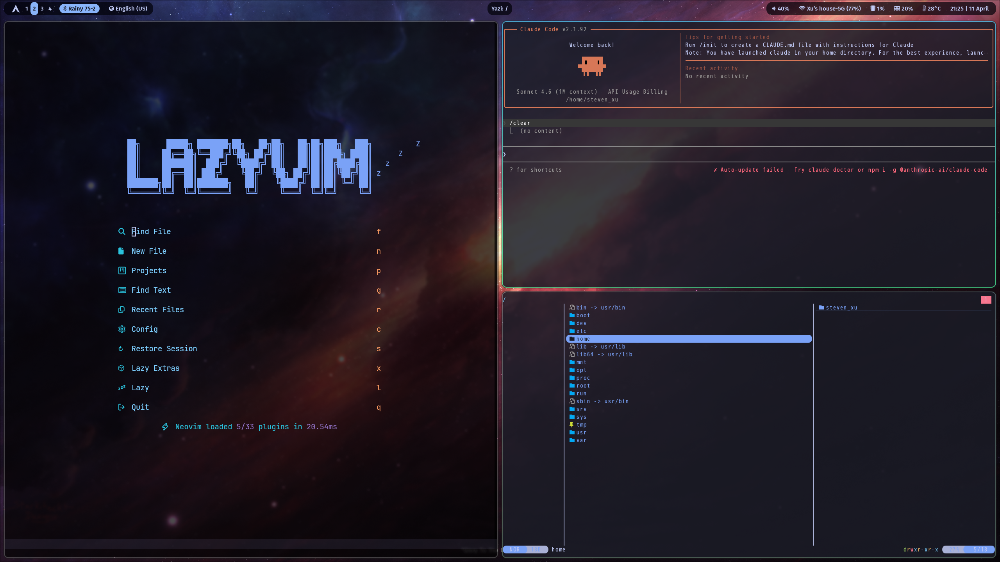

# Dotfiles | 配置文件

> Personal Arch Linux dotfiles with Hyprland, Kitty, Waybar, Yazi and more.
>
> 个人 Arch Linux + Hyprland 配置文件，包含 Kitty、Waybar、Yazi 等工具。

---

## Components | 组件

| Component | Version | Description | 说明 |
|-----------|---------|-------------|------|
| Hyprland | 0.54.3 | Wayland compositor | Wayland 合成器 |
| Waybar | 0.15.0 | Status bar ([SimpleBlueColorWaybar](https://github.com/d00m1k/SimpleBlueColorWaybar)) | 状态栏 |
| Yazi | 26.1.22 | Terminal file manager | 终端文件管理器 |
| Kitty | 0.46.2 | Terminal emulator | 终端模拟器 |
| Mako | 1.11.0 | Notification daemon | 通知守护进程 |
| Tmux | 3.6 | Terminal multiplexer | 终端复用器 |
| Fish | 3.7.0 | Shell | Shell |

**Features** / **功能**:
- Yazi: Neovide default editor, imv image viewer, LibreOffice office documents | Neovide 默认编辑器，imv 图片查看器，LibreOffice 办公文档
- Mako: Desktop notifications with sound support (using libcanberra) | 桌面通知支持声音提示（使用 libcanberra）
- Fish: Smart shell with syntax highlighting and smart completions | 智能 Shell，支持语法高亮和智能补全

> **Neovim**: Not included in this repo. Please install [LazyVim](https://www.lazyvim.org/) separately:
>
> **Neovim**: 本仓库不包含 Neovim 配置。请自行安装 [LazyVim](https://www.lazyvim.org/):
> ```bash
> mv ~/.config/nvim ~/.config/nvim.bak
> mv ~/.local/share/nvim ~/.local/share/nvim.bak
> git clone https://github.com/LazyVim/starter ~/.config/nvim
> rm -rf ~/.config/nvim/.git
> ```

---

## Installation | 安装

### Method 1: GNU Stow (Recommended) / 方法 1: GNU Stow（推荐）

```bash
cd ~
git clone https://github.com/stevenx65/my-dotfiles.git
cd my-dotfiles
stow hypr kitty waybar yazi mako tmux
```

> `.stowrc` 已配置 `--target=$HOME/.config` 和 `--dir=.config`。

> The `.stowrc` file already configures `--target=$HOME/.config` and `--dir=.config`.

---

### Method 2: install.sh / 方法 2: install.sh

此脚本会执行以下操作：
- 备份现有配置到 `~/.config_backup_<timestamp>/`
- 复制配置文件到 `~/.config/`
- 执行 `sudo pacman -S` 安装系统包（Hyprland、Waybar 等）

```bash
./install.sh
```

#### Selective Installation / 选择性安装

可以只安装特定的配置：

```bash
# 列出可用配置
./install.sh -l

# 只安装 Hyprland 和 Waybar
./install.sh -c hypr -c waybar

# 只安装 fish（跳过确认）
./install.sh -c fish -y

# 显示帮助
./install.sh -h
```

**可用配置 / Available Configurations:**

| 选项 | 说明 |
|------|------|
| `hypr` | Hyprland 窗口管理器配置 |
| `waybar` | Waybar 状态栏配置 |
| `kitty` | Kitty 终端配置 |
| `yazi` | Yazi 文件管理器配置 |
| `mako` | Mako 通知守护进程配置 |
| `tmux` | Tmux 终端复用器配置 |
| `fish` | Fish shell 配置 |

> 请查看 [install.sh](install.sh) 源码了解具体行为后再运行。

---

## Dependencies | 依赖

### Desktop / 桌面环境

```bash
# Core / 核心组件
sudo pacman -S hyprland waybar kitty yazi neovim stow libreoffice-fresh

# Image & Media / 图片与媒体
yay -S imv        # Image viewer | 图片查看器 (used by Yazi | Yazi 用)
sudo pacman -S vlc  # Video player | 视频播放器
```

### Waybar Dependencies / Waybar 依赖

The Waybar config uses these additional programs for on-click actions:

Waybar 配置使用以下额外程序实现点击功能：

| Module | On-click Program | Package | Purpose | 用途 |
|--------|------------------|---------|---------|------|
| `custom/arch` | wlogout | `wlogout` | Power menu | 电源菜单 |
| `pulseaudio` | pavucontrol | `pavucontrol` | Volume control | 音量控制 |
| `network` | nm-connection-editor | `network-manager-applet` | Network settings | 网络设置 |
| `cpu` | btop | `btop` | System monitor | 系统监控 |
| `bluetooth` | blueman-manager | `blueman` | Bluetooth manager | 蓝牙管理 |

```bash
# Install Waybar deps / 安装 Waybar 依赖
sudo pacman -S wlogout pavucontrol network-manager-applet btop blueman
```

---

## Tmux Configuration | Tmux 配置

Tmux 配置使用 Catppuccin Mocha 主题和 TPM 插件管理：

| Plugin | Description |
|--------|-------------|
| [tpm](https://github.com/tmux-plugins/tpm) | Tmux 插件管理器 |
| [catppuccin](https://github.com/catppuccin/tmux) | Catppuccin 主题 |
| tmux-cpu | CPU 监控 |
| tmux-battery | 电池监控 |

### 安装插件 / Install Plugins

安装完配置后，在 tmux 中按 `Ctrl + b` 然后按 `I` 键安装插件。

---

## Keybindings | 快捷键

### Basic Operations | 基础操作

| Key | Function | 功能 |
|-----|----------|------|
| `Super + Q` | Open terminal | 打开终端 |
| `Super + C` | Close window | 关闭窗口 |
| `Super + M` | Exit Hyprland | 退出 Hyprland |
| `Super + E` | Open file manager | 打开文件管理器 |
| `Super + V` | Toggle float/tile | 浮动/平铺切换 |
| `Super + R` | Open application menu | 打开应用菜单 |
| `Super + F` | Fullscreen | 全屏 |

---

## Yazi Features | Yazi 功能

### LibreOffice Integration / LibreOffice 集成

Yazi is configured to open various office documents with LibreOffice:

Yazi 已配置使用 LibreOffice 打开各种办公文档：

| File Type | Extension | Opener | 打开方式 |
|-----------|-----------|--------|----------|
| Word | `.doc`, `.docx`, `.odt` | Writer | 文字处理 |
| Excel | `.xls`, `.xlsx`, `.ods`, `.csv` | Calc | 电子表格 |
| PowerPoint | `.ppt`, `.pptx`, `.odp` | Impress | 演示文稿 |
| Visio | `.vsd`, `.vsdx` | Draw | 绘图 |
| PDF | `.pdf` | Draw | 绘图 |

### Default Openers / 默认打开程序

| Category | Default | Fallback | File Type | 中文说明 |
|----------|---------|----------|-----------|----------|
| Text files | Neovide (GUI Neovim) | Neovim (Terminal) | text/*, .md, .conf | 文本文件 |
| Images | imv | - | image/*, .jpg, .png, .gif, .webp | 图片 |
| Videos | VLC | - | video/*, .mp4, .mkv, .avi | 视频 |

### Settings / 设置

- Show hidden files by default / 默认显示隐藏文件
- Image preview enabled / 启用图片预览

---

## Screenshots | 截图



---

## Acknowledgments | 致谢

- [SimpleBlueColorWaybar](https://github.com/d00m1k/SimpleBlueColorWaybar) - Waybar configuration base / Waybar 配置基础
- [Hyprland](https://hyprland.org/) - Dynamic tiling Wayland compositor / 动态平铺 Wayland 合成器
- [Yazi](https://yazi-rs.github.io/) - Blazing fast terminal file manager / 极速终端文件管理器
- [Catppuccin](https://github.com/catppuccin/tmux) - Catppuccin theme for tmux / Tmux 主题

## License | 许可证

MIT
